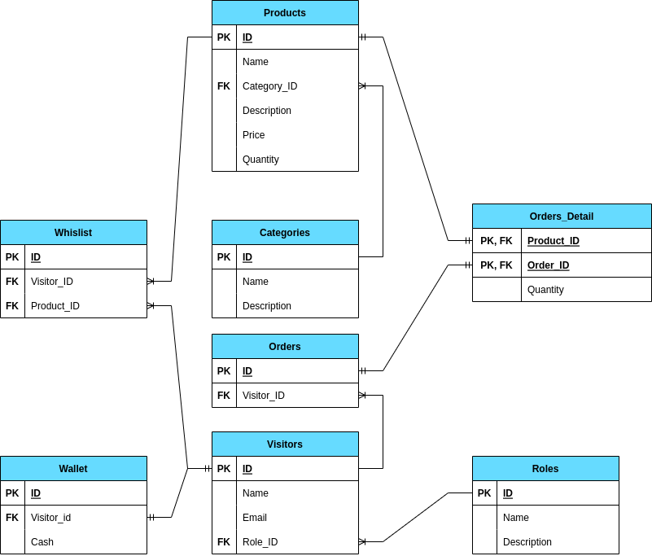
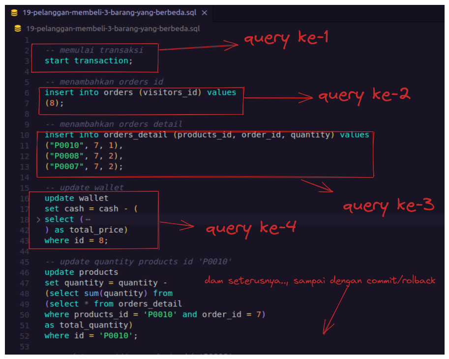

# ONLINE RETAIL DB

- ##### Design ERD

- ##### CARA MENGGUNAKAN
  1.  Lakukan query sesuai dengan urutan nomor (ex : 01 sampai 22)
  2.  Khusus untuk file nomor sql **19** harus di eksekusi perquery di dalamanya "karena mengandung transaction"

example:

